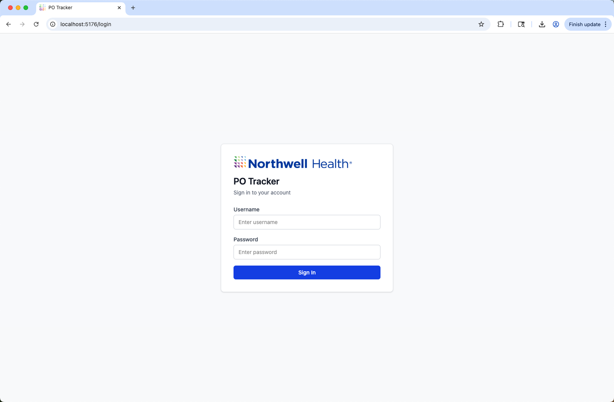
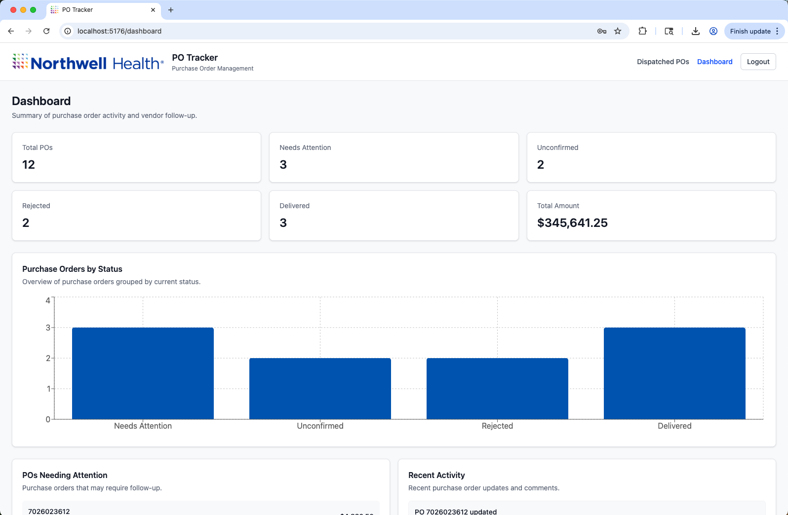
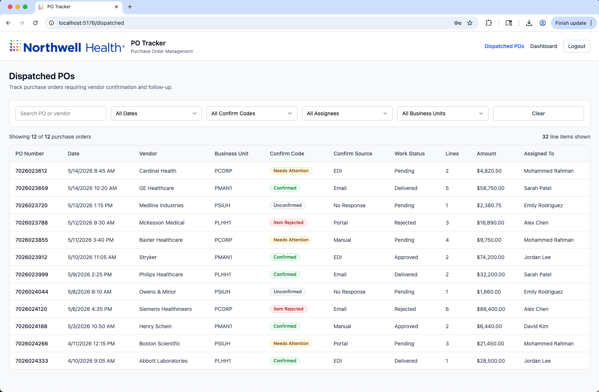
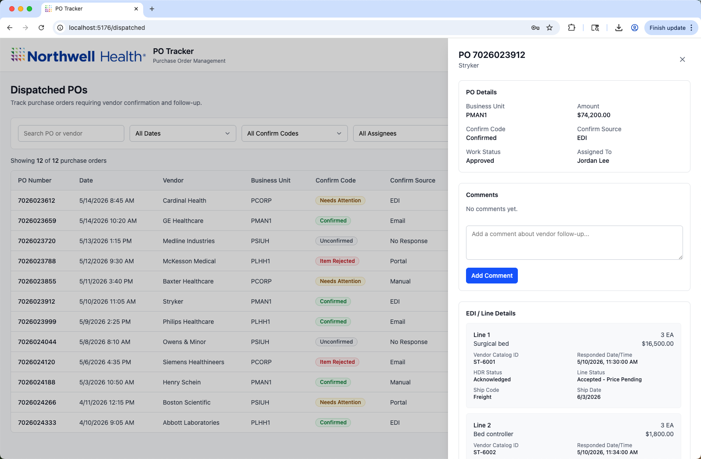
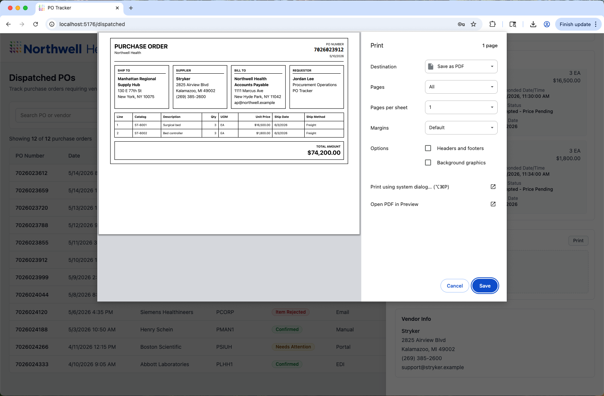

# PO Tracker

PO Tracker is a frontend prototype for managing dispatched purchase orders, vendor confirmations, and procurement follow-up workflows.

The application was built as a React + TypeScript project focused on enterprise UX patterns, responsive design, workflow management, and frontend architecture.

---

# Live Demo

https://po-tracker-chi.vercel.app/login

---

# Screenshots

## Login



---

## Dashboard



---

## Dispatched Purchase Orders



---

## Purchase Order Details Drawer



---

## Print Preview



---

# Features

## Authentication
- Mock login flow
- Protected routes
- Logout workflow

## Dashboard
- Purchase order summary cards
- Recent activity feed
- POs requiring attention

## Dispatched Purchase Orders
- Responsive enterprise-style data table
- Search and filtering
- Date range filtering
- Confirm code filtering
- Assignee filtering
- Business unit filtering
- Dynamic result counts

## Purchase Order Details Drawer
- PO details
- Work status
- Vendor information
- EDI / line details
- Comments workflow
- Printable purchase order / shipping label
- Slide-out drawer interactions
- Click-outside-to-close behavior

## Comments
- Add comments to purchase orders
- Auto-scroll to newest comment
- Empty comment validation

## Responsive Design
- Mobile-friendly layouts
- Responsive filters
- Horizontal table scrolling
- Responsive drawer layouts

## Printing
- Printable landscape purchase order layout
- Shipping-label-inspired print preview
- Single-page print optimization

---

# Tech Stack

- React
- TypeScript
- Vite
- Tailwind CSS
- React Router
- TanStack Table
- Vitest
- Recharts

---

# Getting Started

## Install dependencies

```bash
npm install
```

## Start development server

```bash
npm run dev
```

## Run tests

```bash
npm test
```